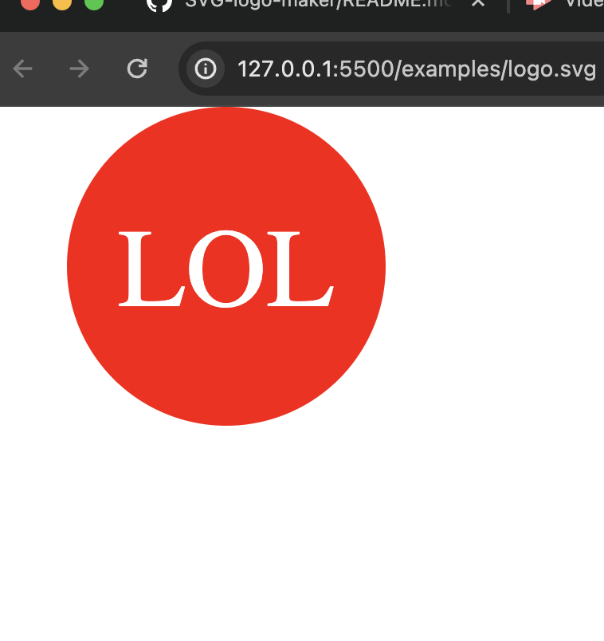

# simply-logo-maker

## Description 
The purpose for is to create a logo make where the user will be able to pick the shape, color of text and shape, with a max of 3 letters.
This will generate the logo. 

## Installation 
I use the install inquire as well as jest.

 ## Setup 
Look at the mockup and set up nesscary files that is needed in the criteria and follow to makeup the the files and folders.

## Usage 
To start and generate the logo I use to node.

## Video 
Demonstration of logo maker.
Watch a [video](https://watch.screencastify.com/v/0cn2O91tHbQZp4I4UTwB) demonstration of the basic functionality:

